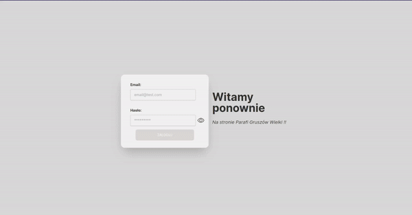

<p align="center">
  
</p> 

# PARISH-WEBPAGE-ADMIN-PANEL

**PARISH-WEBPAGE -** is a full-stack application that aims to present a simple parish website with the ability to edit certain things like intentions and announcements, in the style of a simple "Wordpress". The project consists of three repositories:

- [FRONTEND - CLIENT](https://github.com/xyashino/parish-webpage-front)
- [BACKEND](https://github.com/xyashino/parish-webpage-backend)
- [FRONTEND - ADMIN PANEL](https://github.com/xyashino/parish-webpage-adminpannel)

## YOU ARE CURRENTLY VIEWING THE FRONTEND REPOSITORY (ADMIN PANEL)
**Frontend repository (ADMIN PANEL)-** This is an admin panel that allows you to manage the parish website, among other things, you can:
- edit/add
    - announcements
    -  intentions
    - albums (possibility of uploading photos)
  
In addition, draft-js has been implemented to use a rich text editor when adding/editing.
### UPLOAD DOES NOT WORK LOCALLY / DOES NOT DISPLAY PHOTOS BUT UPLOADS THEM TO THE SPECIFIED FOLDER


## DEMO
**YOU CAN ALWAYS CHECK THE APPLICATION [HERE](https://admin.yashino.usermd.net/).**

``
  LOGIN:test@wp.pl
  PASSWORD:test1234
``
<p align="center">
  
</p> 

## HOW TO DOWNLOAD THE REPOSITORY
1. Clone the `PARISH-WEBPAGE-ADMIN-PANEL` repository to your computer.
```bash
git clone https://github.com/xyashino/parish-webpage-admin-panel.git
```
2. Open the terminal and go to the parish-webpage-front/ folder in the repository.
```bash
cd parish-webpage-admin-panel/
```
3. Install packages.
```bash
yarn
```
4. Run the application.
```bash
yarn dev
```
# WARNING !!!
## THIS APPLICATION REQUIRES A [BACKEND](https://github.com/xyashino/parish-webpage-backend) SO IF YOU WANT TO RUN IT, YOU NEED TO RUN THE BACKEND OTHERWISE YOU WILL ONLY SEE THE LOGIN PAGE
If you don't change the default settings, everything should work right away.

You **need** to rename the file from `.env.example` to `.env` and set the `VITE_API_URL` variable to the running server's URL.
